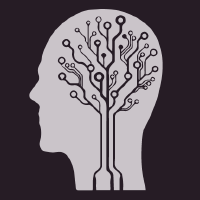

 
  diyabasrai@gmail.com 

# Diya Basrai  

Neuroscience PhD student interested in the neural basis of movement through experimental and computational approaches

## Education

#### Northwestern University (2022-present) 

* PhD student, Interdepartmental Neursocience

#### University of California, San Diego (2015-2019) 

* B.S., magna cum laude, Physiology and Neuroscience

## Research Experience

#### PhD Student, Miri/Glaser labs (2023-present) 

* Examining thalamocortical interactions underlying naturalistic movement in mice
* Conducting large-scale neural recording while applying targeted perturbations to neural activity
* Analyzing multi-region interactions using novel modelling approach

#### Research Tech, Tresch Lab (2020-2022)

* Applying brain-machine interfaces to restore walking in rats with spinal cord injury

#### Undergrad Researcher, Pandarainath Lab (2018-2020) 

* Created the [autoLFADS](https://snel-repo.github.io/autolfads/) tutorial, explaining how to use a custom deep learning tool to analyze single-trial neural population data.

## Publications/Preprints/Conferences

* Akiko Saiki-Ishikawa, Mark Agrios, Sajishnu Savya, Adam Forrest..., Diya Basrai..., Andrew Miri. (2024) Hierarchy between forelimb premotor and primary motor cortices and its manifestation in their firing patterns, [BioRxiv](https://www.biorxiv.org/content/10.1101/2023.09.23.559136v2)

* Alex Burton... Diya Basrai... Matthew Tresch, Philipp Gutruf. (2023) Fully implanted battery-free high power platform for chronic spinal and muscular functional electrical stimulation, [Nature Communications](https://www.nature.com/articles/s41467-023-43669-2)

* Mohammad Reza Keshtkaran, Andrew R. Sedler, ..., Diya Basrai..., Chethan Pandarinath (2022) A large-scale neural network training framework for generalized estimation of single-trial population dynamics, [Nature Methods](https://www.nature.com/articles/s41592-022-01675-0)

* Diya Basrai, ..., Joshua Glaser, Matthew Tresch. (2022) Aligning Neural Activity Recorded from Rats during Locomotion Across Time And Subjects, [poster](./media/sfn22poster.pdf) at SFN 2022

* Diya Basrai, ..., Matthew Tresch. (2021) Using DeepLabCut To Predict Locations of Subdermal Landmarks From Video, [poster](./media/dlcposter.pdf) at NIH's BRAIN Initiative Meeting 2021 and conference paper at [Living Machines 2022 conference](https://link.springer.com/chapter/10.1007/978-3-031-20470-8_29)

## Teaching Experience

#### Teaching Assistant at Northwestern University (2024-present)

* TA for two quarters, teaching undergraduate neuroscience courses (systems neuroscience, human genetics)

#### Teaching Assistant at University of California, San Diego (2018-2019)

* TA for four quarters teaching undergraduate biology courses (molecular biology x3, comparative physiology)

** Received [>90% recommendation](./media/ia_evaluation.pdf) from students in all quarters teaching

#### Miscellaneous

* Teaches Stand-up 101 @ The Revival Theater

* Gave lecture to Walter Payton Prep School on causality as part of outreach program

## Other

* Stand-up comic, recently released [comedy special](https://www.youtube.com/watch?v=y_IceD5ij1o)

* Headline contributor for The Onion, sample work [here][https://dbasrai.github.io/onion]
